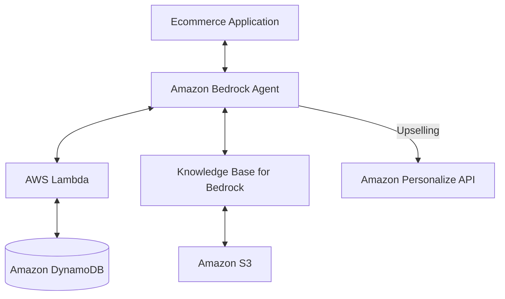

# Workshop 01: Build a product recommendation chatbot with Amazon Bedrock Agents

## 📋 Overview
Este workshop se enfoca en la creación de un chatbot inteligente para aplicaciones de e-commerce utilizando **Amazon Bedrock Agents**. El agente es capaz de interactuar con los usuarios, comprender sus preferencias y realizar tareas dinámicas invocando APIs de backend.

## 🏗️ Arquitectura
La solución sigue un enfoque **Serverless** y desacoplado:

### Componentes Clave:
1.  **Amazon Bedrock Agents**: Orquestador de la conversación que utiliza modelos fundacionales para interactuar con el usuario.
2.  **AWS Lambda**: Actúa como la lógica de negocio para las "Action Groups" del agente.
3.  **Amazon DynamoDB**: Almacena el catálogo de productos y los carritos de compras.
4.  **Amazon S3 + Knowledge Bases**: Proporciona contexto adicional al agente mediante RAG (Retrieval-Augmented Generation).
5.  **Multi-agent Collaboration**: Coordinación entre un agente especializado en recomendaciones y uno en gestión de carritos.

## 🚀 Pasos Principales
- **Configuración de Infraestructura**: Creación de tablas DynamoDB y poblamiento de datos con `PopulateProductsTableFunction`.
- **Creación del Agente**: Definición de instrucciones del sistema y selección del modelo fundacional.
- **Action Groups**: Configuración de la integración con Lambda para consultar productos (`GetProductDetailsFunction`).
- **Knowledge Bases**: Ingesta de documentos desde S3 para mejorar las respuestas.
- **Advanced Logic**: Implementación de venta cruzada (up-selling) simulando APIs de Amazon Personalize.

## 💡 Aprendizajes
- Cómo transformar instrucciones en lenguaje natural en llamadas a API eficientes.
- El uso de **Knowledge Bases** para reducir alucinaciones en modelos de IA.
- Orquestación de múltiples agentes para tareas especializadas (Product Reco vs Cart Management).

---
*Workshop realizado como parte del camino a Solution Architect.*
