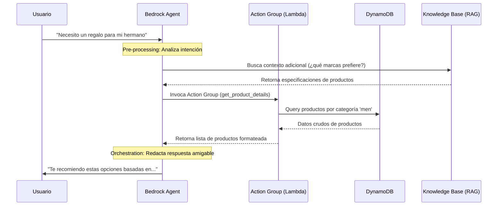

# Workshop 01: Product Recommendation Chatbot with Amazon Bedrock Agents

  

## 📋 Resumen Ejecutivo
En este workshop, implementé un **Agente de Amazon Bedrock** diseñado para aplicaciones de e-commerce. Este agente utiliza modelos de lenguaje (LLMs) para interactuar con clientes, entender sus necesidades y recomendar productos de forma dinámica consumiendo APIs reales.

---

## 🏗️ Arquitectura de la Solución
La solución utiliza una arquitectura **Serverless** que integra capacidades de IA con servicios tradicionales de AWS.

### Diagrama de Alto Nivel

### Flujo Detallado de una Consulta (Sequence Diagram)
Para entender cómo "piensa" el agente, este es el flujo lógico cuando un usuario pide una recomendación:

---

## 🛠️ Detalle de los "Action Groups" e integración
Uno de los puntos clave del laboratorio es cómo el agente interactúa con el mundo exterior:

1.  **Definición de OpenAPI**: Se utiliza un esquema JSON/YAML para decirle al agente qué funciones existen (ej: `get_product_details`).
2.  **Lógica en Lambda**: La función Lambda recibe la intención del agente, extrae parámetros (como `category` o `gender`) y consulta DynamoDB.
3.  **Knowledge Bases (RAG)**: A diferencia de los datos estructurados en DynamoDB, las Knowledge Bases permiten al agente leer archivos PDF o de texto en S3 para responder preguntas complejas sobre garantía, materiales o manuales de uso.

---

## 📸 Evidencia de Implementación

### 1. Configuración del Agente
Se definieron las instrucciones del sistema y se seleccionó el modelo fundacional (Claude).

  

### 2. Trazabilidad y Razonamiento (Orchestration Trace)
Aquí se observa cómo el agente "piensa" y decide qué API llamar basándose en la charla con el usuario.

  

### 3. Resultados Finales
El agente es capaz de gestionar carritos y recomendar productos con precisión.

  

---

## 💡 Key Takeaways
- **Generative AI Agents**: Aprendí a pasar de un modelo estático a un agente proactivo que ejecuta acciones.
- **RAG (Retrieval Augmented Generation)**: Implementación de conocimiento externo sin re-entrenar el modelo.
- **Multi-Agent Collaboration**: Uso de agentes especializados trabajando en conjunto para una tarea compleja.

---
*Este proyecto forma parte de mi portafolio impulsado por la beca de Solution Architect.*
