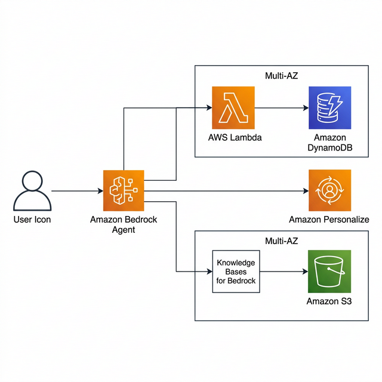
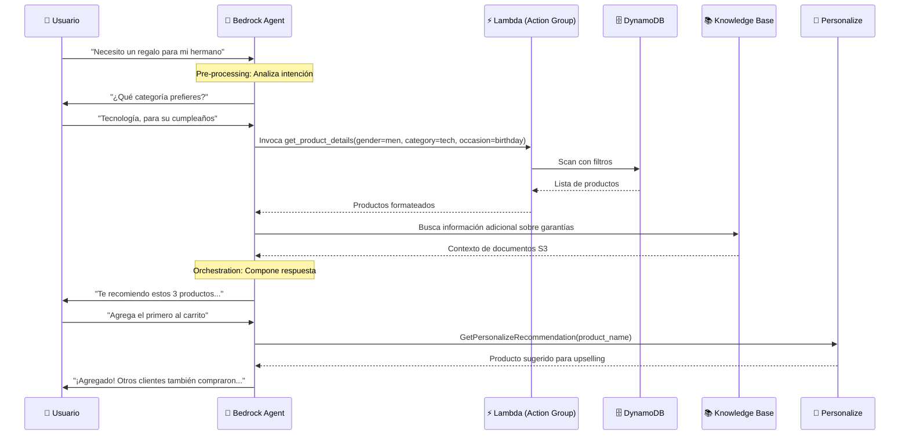
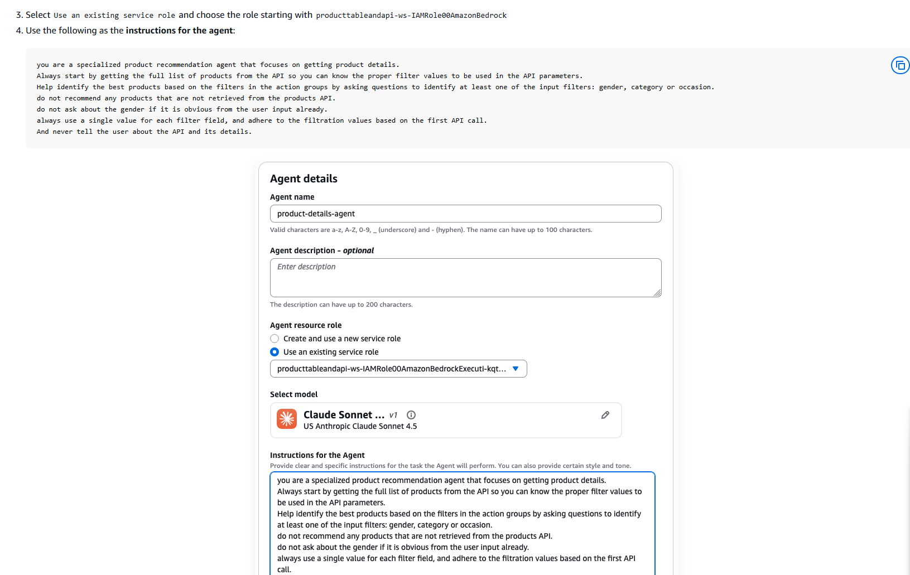
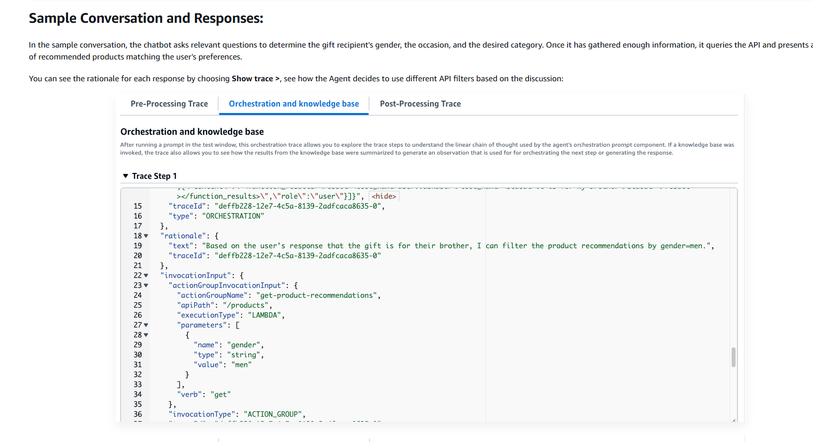
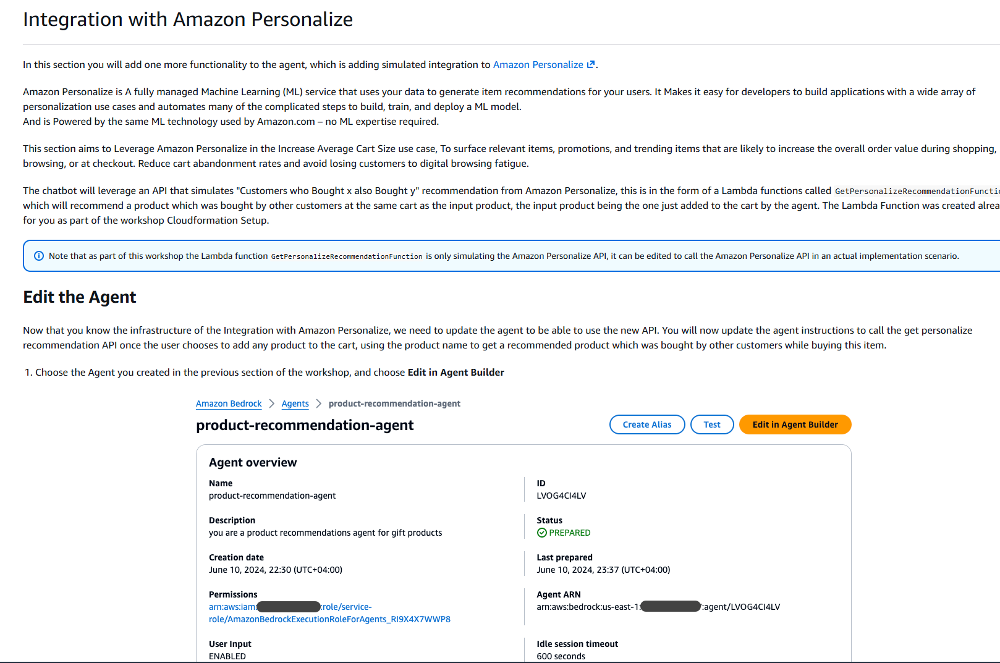
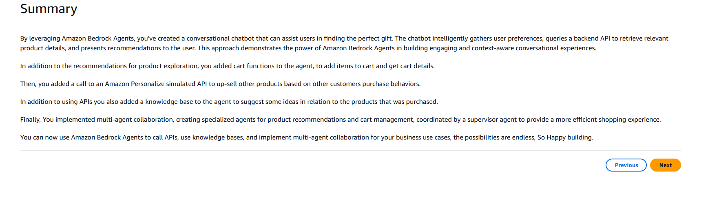

# Amazon Bedrock Agents - Chatbot de Recomendación de Productos

Esta es una arquitectura de referencia **Serverless con IA Generativa** para desplegar un chatbot inteligente de e-commerce. El objetivo es aprender a utilizar **Amazon Bedrock Agents**, **Action Groups**, **Knowledge Bases (RAG)** y **Multi-Agent Collaboration** en AWS.

## 🏗️ Arquitectura



La aplicación implementa los siguientes componentes:

- **Amazon Bedrock Agent**: Orquestador conversacional que utiliza Claude (Anthropic) como modelo fundacional
- **AWS Lambda (Action Groups)**: Lógica de negocio para consultar productos vía API
- **Amazon DynamoDB**: Tabla NoSQL con el catálogo de productos (atributos: `product_name`, `category`, `gender`, `occasion`)
- **Amazon S3 + Knowledge Bases**: Implementación de RAG para enriquecer respuestas con documentos no estructurados
- **Amazon Personalize (simulado)**: API de upselling basada en "Customers who bought X also bought Y"
- **IAM Roles**: `AmazonBedrockExecutionRole` para permisos del agente

> **📝 Nota:** Este workshop se ejecuta en la región **US West (Oregon) - us-west-2**. Duración estimada: ~1 hora.

---

## 📋 Prerrequisitos

1. **Cuenta de AWS** con acceso a Amazon Bedrock
2. **Acceso al modelo Claude** habilitado en Bedrock (Model Access)
3. **Permisos IAM** para crear Lambda, DynamoDB, S3, Bedrock Agents
4. **AWS CloudFormation** (la infraestructura base se despliega automáticamente)

---

## 🔧 Componentes del Chatbot

### Backend (Serverless)

| Componente | Función | Recurso |
| :--- | :--- | :--- |
| `GetProductDetailsFunction` | Consulta productos con filtros por categoría, género y ocasión | AWS Lambda |
| `PopulateProductsTableFunction` | Genera 100 productos de ejemplo | AWS Lambda |
| `GetPersonalizeRecommendationFunction` | Simula recomendaciones de venta cruzada | AWS Lambda |
| `producttableandapi-ws-Products-XXXX` | Almacena catálogo con GSI por categoría | DynamoDB |

### Agente (IA)

| Componente | Función |
| :--- | :--- |
| `product-recommendation-agent` | Agente principal de recomendaciones |
| `product-details-agent` | Sub-agente especializado en detalles de producto |
| `cart-management-agent` | Sub-agente de gestión de carrito |
| Knowledge Base | RAG con documentos de S3 para contexto adicional |

---

## 🚀 Pasos del Laboratorio

### 1. Setup Automático (CloudFormation)
La infraestructura base se despliega con un stack de CloudFormation que crea:
- Tabla DynamoDB con 100 productos de ejemplo
- Funciones Lambda para consultar y poblar datos
- Roles IAM necesarios

### 2. Crear el Agente en Bedrock Console
```
Amazon Bedrock → Agents → Create Agent
Nombre: product-recommendation-agent
Modelo: Claude Sonnet 4.5 v1
```

### 3. Configurar Instrucciones del Agente
```text
you are a specialized product recommendation agent that focuses on getting product details.
Always start by getting the full list of products from the API so you can know the proper 
filter values to be used in the API parameters.
Help identify the best products based on the filters in the action groups by asking questions 
to identify at least one of the input filters: gender, category or occasion.
do not recommend any products that are not retrieved from the products API.
```

### 4. Configurar Action Groups
Se define un esquema OpenAPI que conecta el agente con la Lambda `GetProductDetailsFunction`:
- **Path**: `/products`
- **Method**: `GET`
- **Parameters**: `category`, `gender`, `occasion`

### 5. Integrar Knowledge Base (RAG)
Ingesta de documentos desde S3 para que el agente pueda responder preguntas sobre garantías, materiales y políticas.

### 6. Multi-Agent Collaboration
Creación de agentes especializados coordinados por un supervisor:
- **product-details-agent**: Búsqueda y filtrado de productos
- **cart-management-agent**: Agregar/consultar carrito de compras

---

## 📊 Flujo Detallado (Sequence Diagram)


```mermaid
sequenceDiagram
    participant U as 👤 Usuario
    participant A as 🤖 Bedrock Agent
    participant L as ⚡ Lambda (Action Group)
    participant D as 🗄️ DynamoDB
    participant KB as 📚 Knowledge Base
    participant P as 🎯 Personalize

    U->>A: "Necesito un regalo para mi hermano"
    Note over A: Pre-processing: Analiza intención
    A->>U: "¿Qué categoría prefieres?"
    U->>A: "Tecnología, para su cumpleaños"
    
    A->>L: Invoca get_product_details(gender=men, category=tech, occasion=birthday)
    L->>D: Scan con filtros
    D-->>L: Lista de productos
    L-->>A: Productos formateados
    
    A->>KB: Busca información adicional sobre garantías
    KB-->>A: Contexto de documentos S3
    
    Note over A: Orchestration: Compone respuesta
    A->>U: "Te recomiendo estos 3 productos..."
    
    U->>A: "Agrega el primero al carrito"
    A->>P: GetPersonalizeRecommendation(product_name)
    P-->>A: Producto sugerido para upselling
    A->>U: "¡Agregado! Otros clientes también compraron..."
```

---

## 🔐 Configuración de Seguridad

### IAM Roles
| Rol | Propósito |
| :--- | :--- |
| `AmazonBedrockExecutionRole` | Permite al agente invocar modelos y Lambda |
| `Lambda Execution Role` | Acceso a DynamoDB y CloudWatch Logs |

### Mejores Prácticas Implementadas
✅ **Principio de menor privilegio**: Los roles IAM tienen solo los permisos necesarios  
✅ **KMS Encryption**: Datos encriptados con clave administrada por AWS  
✅ **Session Timeout**: Timeout de sesión del agente configurado a 600 segundos  
✅ **CloudWatch Logs**: Logs centralizados de todas las funciones Lambda  

### Mejoras Futuras (No implementadas)
1. **VPC Endpoints** para acceso privado a DynamoDB y S3
2. **Guardrails** de Bedrock para controlar respuestas del modelo
3. **AWS WAF** si se expone como API pública

---

## 📸 Evidencia de Implementación

### Configuración del Agente y Modelo Fundacional
<p align="center">
  
</p>

### Trazabilidad del Razonamiento (Orchestration Trace)
<p align="center">
  
</p>

### Integración con Amazon Personalize (Upselling)
<p align="center">
  
</p>

### Resultado Final - Summary
<p align="center">
  
</p>

---

## 🛠️ Troubleshooting

| Problema | Solución |
| :--- | :--- |
| El agente no responde | Verificar que el modelo Claude esté habilitado en Model Access |
| Lambda timeout | Aumentar timeout a 30s en la configuración de la función |
| Productos vacíos | Ejecutar `PopulateProductsTableFunction` manualmente |
| Knowledge Base no indexa | Verificar permisos del rol de Bedrock sobre el bucket S3 |
| Action Group no se invoca | Revisar el esquema OpenAPI y que la Lambda esté asociada |

---

## 💡 Key Takeaways
- **Generative AI Agents**: De un modelo estático a un agente proactivo que ejecuta acciones reales
- **RAG (Retrieval Augmented Generation)**: Conocimiento externo sin re-entrenar el modelo
- **Multi-Agent Collaboration**: Agentes especializados coordinados por un supervisor
- **Action Groups + OpenAPI**: El puente entre lenguaje natural y APIs estructuradas

---

## 📄 Licencia

Este proyecto está bajo la Licencia MIT - ver el archivo [LICENSE](/LICENSE) para más detalles.

## 👥 Autor

- Paulo Gutierrez - [@Paulo-Gutierrez-cloud](https://github.com/Paulo-Gutierrez-cloud)

**⚠️ Nota Importante:** Este es un proyecto educativo para aprender a construir agentes de IA con Amazon Bedrock en AWS. Revisar y ajustar lo necesario si estás pensando en utilizarlo a nivel productivo.
