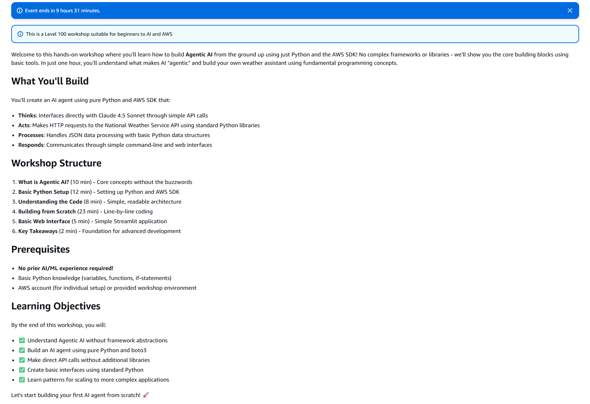
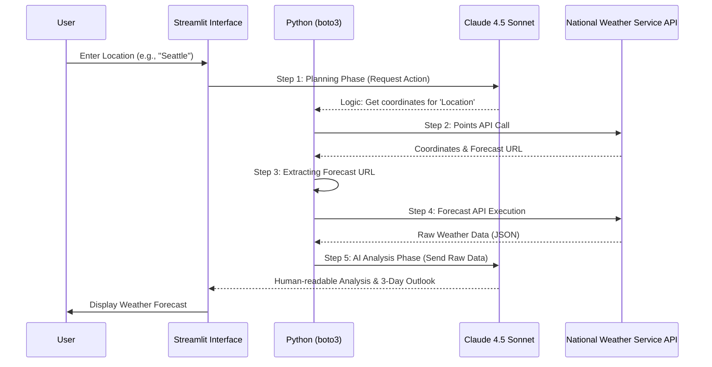
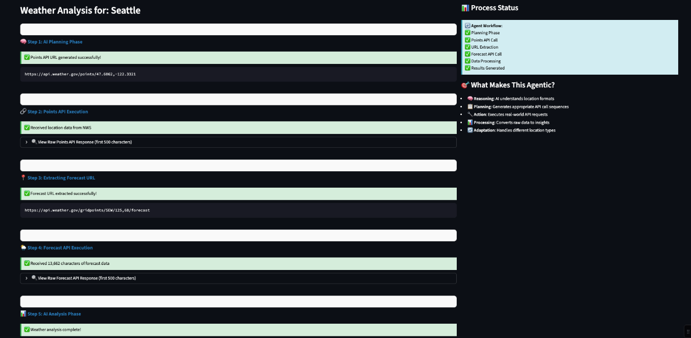
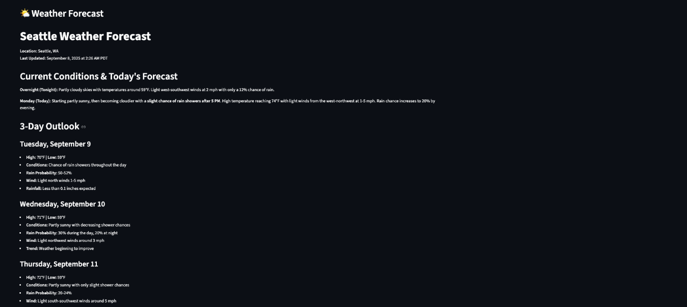

# 🏗️ Workshop 02: Agentic AI Weather Assistant

> **Level 100:** Build an autonomous AI Agent from scratch using pure Python, the AWS SDK, and Claude 4.5 Sonnet on Amazon Bedrock.

---

## 📄 Executive Summary

This workshop demonstrates the core principles of **Agentic AI**—Autonomy, Reactivity, and Proactivity. Instead of a simple chatbot, you build an agent that can **Think, Plan, and Act**. This agent autonomously interacts with the National Weather Service (NWS) API to provide accurate, real-time weather forecasts and analysis for any location in the US.

### Key Objectives
*   **Understand Agentic AI** without complex framework abstractions.
*   **Implement Tool-Use (Function Calling)** manually using `boto3`.
*   **Orchestrate a Multi-Step Workflow**: From planning to final summary.
*   **Build a Professional UI** using Streamlit to visualize the agent's internal reasoning.

---

## 📐 Architecture Overview

The "Weather Assistant" follows a classic agentic loop: **Reasoning -> Planning -> Action -> Processing -> Adaptation**.

### Technical Architecture


### Core Workflow (Sequence Diagram)



---

## 🛠️ Components & Technologies

| Component | Technology | Role |
| :--- | :--- | :--- |
| **Orchestration** | Python / `boto3` | Manages API calls, error handling, and state. |
| **Brain / Reasoning** | Amazon Bedrock (Claude 4.5 Sonnet) | Interprets user intent, plans API calls, and analyzes data. |
| **Action (Tools)** | National Weather Service API | Provides real-time meteorological data. |
| **Frontend** | Streamlit | Interactive web interface with a 'Process Status' sidebar. |

---

## 🔐 Security & IAM Permissions

In a real-world scenario, your IAM Role/User requires the following permissions to interact with Amazon Bedrock:

```json
{
    "Version": "2012-10-17",
    "Statement": [
        {
            "Effect": "Allow",
            "Action": [
                "bedrock:InvokeModel",
                "bedrock:Converse",
                "bedrock:ListFoundationModels"
            ],
            "Resource": "*"
        }
    ]
}
```

> [!IMPORTANT]
> Ensure **Claude 4.5 Sonnet** access is enabled in the Amazon Bedrock console for your specific region (e.g., `us-west-2`).

---

## 🚀 Implementation Guide

### 1. Environment Setup
Regardless of your setup path, ensure you have the required dependencies:
```bash
# Create and activate venv
python -m venv .venv
source .venv/bin/activate  # macOS/Linux
.venv\Scripts\activate     # Windows

# Install dependencies
pip install -r requirements.txt
```

### 2. The Five Execution Phases
The agent's progress is visible in the Streamlit UI as it moves through these phases:
1.  **AI Planning**: The model decides how to handle the location request.
2.  **Points API Call**: Fetching the metadata for the specific latitude/longitude.
3.  **URL Extraction**: Identifying the specific forecast endpoint.
4.  **Forecast API Execution**: Retrieving the raw weather JSON.
5.  **AI Analysis**: Summarizing technical data into a user-friendly forecast.

### 3. Visual Results

*Visualizing the agent's internal workflow and execution status.*


*Complete weather analysis and 3-day outlook for the requested location.*

---

## 🔍 Troubleshooting

| Issue | Potential Cause | Solution |
| :--- | :--- | :--- |
| `AccessDenied` | IAM Permissions | Ensure `bedrock:InvokeModel` is allowed for your user. |
| `ModelNotReady` | Bedrock Model Access | Enable Claude 4.5 Sonnet in the Bedrock Console -> Model Access. |
| `NWS Connection Error` | Network / API Limit | Verify internet access or check if the location is within the US. |

---

## 🧠 Key Takeaways

1.  **Framework Independence**: Understanding agentic patterns without relying on LangChain/CrewAI provides deeper architectural insight.
2.  **Claude specifically excels** at complex reasoning, processing structured JSON data, and planning multi-stage tasks.
3.  **Real-Time Data Access**: How to safely bridge a static LLM with live external APIs using a retrieval-augmented or action-oriented pattern.

---

### Author
**Paulo Gutierrez**
Solution Architect in Training | AWS AI/ML Enthusiast

---
[← Back to Main Journey](../../README.md)
