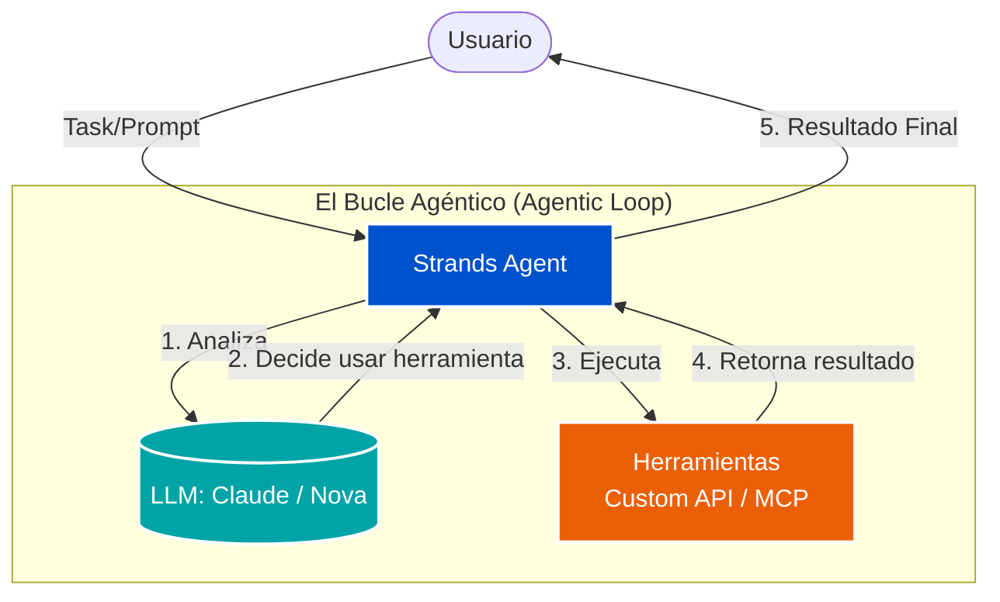

# 🧬 Workshop 03: Introducción a Strands Agents

> **Level 200:** Descubre **Strands Agents**, un SDK open-source enfocado en la creación de agentes de IA basados en modelos que simplifica la interacción entre LLMs (como Amazon Nova y Claude) y herramientas.

---

## 📄 Resumen Ejecutivo

Este laboratorio introduce el marco **Strands Agents**, el cual permite a los desarrolladores construir agentes inteligentes con solo unas pocas líneas de código. En lugar de lidiar con las complejidades de infraestructura de agentes bajo nivel, **Strands** abstrae el bucle agéntico: *Modelo + Herramientas + Prompt = Agente*.

### Objetivos Clave
*   **Comprender el Bucle Agéntico** simplificado: Cómo los modelos razonan nativamente, planifican y usan herramientas.
*   **Soporte Multi-Modelo**: Integración directa con Amazon Bedrock (Nova, Claude), Anthropic, Llama y OpenAI.
*   **Creación Rápida de Herramientas**: Implementación de herramientas personalizadas mediante decoradores (`@tool`).
*   **Arquitecturas Multi-Agente**: Introducción a patrones avanzados como *Agente como Herramienta*, *Enjambre (Swarm)*, *Grafos* y *Flujos de Trabajo*.

---

## 📐 Arquitectura del Bucle Agéntico (Strands)

El bucle agéntico es el corazón de `Strands`. El agente recibe una tarea y comienza un ciclo iterativo de pensamiento y acción hasta completarla.



---

## 🛠️ Tecnologías Utilizadas

| Componente | Tecnología | Rol |
| :--- | :--- | :--- |
| **Orquestador Base** | `strands-agents` (Python SDK) | Gestiona el ciclo de vida del agente y la memoria. |
| **Conector de Herramientas** | `@tool` Decorator / MCP | Transforma funciones Python en herramientas invocables por el LLM. |
| **Despliegue Listos para Empresas** | AWS Lambda / Fargate | Modelos de despliegue nativos soportados. |
| **Observabilidad** | OpenTelemetry (OTEL) / Logging | Rastreo distribuido (tracing) y evaluación del comportamiento del agente. |

---

## 🚀 Guía de Implementación: "Tu Primer Agente"

### 1. Instalación Rápida
```bash
# Instalar el SDK principal y las herramientas integradas
pip install strands-agents strands-agents-tools
```

### 2. Agente con Herramientas Personalizadas
La facilidad de transformar una función estándar de Python en una herramienta de IA es una de las grandes ventajas de Strands.

```python
import logging
from strands import Agent, tool

# 1. Habilitar depuración para ver el "pensamiento" interno del Agente
logging.getLogger("strands").setLevel(logging.DEBUG)
logging.basicConfig(format="%(levelname)s | %(name)s | %(message)s", level=logging.DEBUG)

# 2. Definir una herramienta personalizada
@tool
def get_weather(location: str) -> str:
    """ Get the weather for a specific location """
    # Lógica simulada que idealmente llama a una API externa
    return f"The weather in {location} is 75°F and Sunny."

# 3. Inicializar el Agente con la herramienta y el Prompt del Sistema
agent = Agent(
    tools=[get_weather],
    system_prompt="You are a helpful assistant. You can provide weather updates."
)

# 4. Iniciar el bucle agéntico
response = agent("What is the weather like in Seattle today?")
print(response)
```

---

## 🏛️ Patrones Multi-Agente Soportados

A medida que sus casos de uso crecen, **Strands** escala con usted soportando arquitecturas colaborativas:

1.  **Agente como Herramienta:** Un agente principal delega tareas a sub-agentes especializados (Ej: Agente de código llama a un Agente de pruebas).
2.  **Enjambre (Swarm):** Múltiples agentes trabajan en paralelo de manera colaborativa o competitiva.
3.  **Grafos (Graph):** Red estructurada donde los agentes tienen un flujo de comunicación definido de forma estricta.
4.  **Workflows:** Orquestación compleja multipaso con manejo de errores y secuencias lógicas asíncronas.

### Muestras y Código (Samples)
Echa un vistazo a la carpeta `samples/` en este directorio para explorar los *notebooks* (JupyterLab) y demostraciones prácticas descargadas directamente del repositorio oficial, que cubren la integración con servicios AWS, RAG Agéntico y más.

---

### Autor
**Paulo Gutierrez**
AWS Solution Architect Journey

---
[← Volver al Índice Principal](../../README.md)
